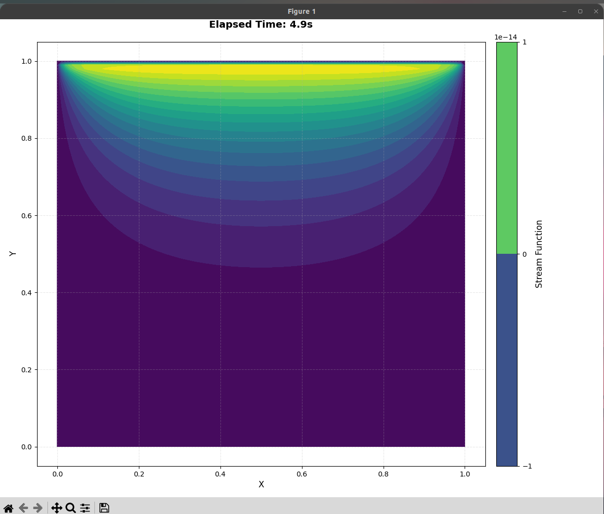

# Lid-Driven Cavity Flow Simulation

## Overview

This project numerically simulates the classic lid-driven cavity flow using the vorticity-streamfunction formulation of the incompressible Navier–Stokes equations. The goal is to visualize and understand the development of vortices and flow patterns in a square cavity with a moving lid, a canonical problem in computational fluid dynamics (CFD).

---

## Why the Vorticity-Streamfunction Formulation?

The incompressible Navier–Stokes equations in primitive variables (velocity and pressure) are:

$$
\frac{\partial \mathbf{u}}{\partial t} + (\mathbf{u} \cdot \nabla)\mathbf{u} = -\frac{1}{\rho} \nabla p + \nu \nabla^2 \mathbf{u}
$$

$$
\nabla \cdot \mathbf{u} = 0
$$

Directly solving for velocity and pressure is challenging due to the pressure-velocity coupling and the incompressibility constraint. The **vorticity-streamfunction formulation** eliminates the pressure term and automatically satisfies incompressibility, making it well-suited for 2D flows:

- **Vorticity** ($\omega$) is defined as the curl of the velocity field:
  $$
  \omega = \frac{\partial v}{\partial x} - \frac{\partial u}{\partial y}
  $$
- **Streamfunction** ($\psi$) is defined such that:
  $$
  u = \frac{\partial \psi}{\partial y}, \quad v = -\frac{\partial \psi}{\partial x}
  $$
  This ensures $\nabla \cdot \mathbf{u} = 0$ by construction.

---

## Mathematical Formulation

The governing equations become:

1. **Poisson equation for the streamfunction:**
   $$
   \nabla^2 \psi = -\omega
   $$
2. **Vorticity transport equation:**
   $$
   \frac{\partial \omega}{\partial t} + u \frac{\partial \omega}{\partial x} + v \frac{\partial \omega}{\partial y} = \nu \nabla^2 \omega
   $$

---

## Discretization and Numerical Implementation

### **Grid and Notation**

- The domain is discretized into a uniform Cartesian grid with $nx \times ny$ points.
- Grid spacings: $\Delta x = \frac{L}{nx-1}$, $\Delta y = \frac{L}{ny-1}$.

### **Discretized Equations**

#### 1. **Poisson Equation for Streamfunction**

Continuous:

$$
\frac{\partial^2 \psi}{\partial x^2} + \frac{\partial^2 \psi}{\partial y^2} = -\omega
$$

Discretized (central differences, at interior point $(i, j)$):

$$
\frac{\psi_{i, j+1} - 2\psi_{i, j} + \psi_{i, j-1}}{\Delta x^2} +
\frac{\psi_{i+1, j} - 2\psi_{i, j} + \psi_{i-1, j}}{\Delta y^2}
= -\omega_{i, j}
$$

**Jacobi Iteration Update:**

$$
\psi_{i, j}^{new} = \frac{
    \Delta y^2 (\psi_{i, j+1} + \psi_{i, j-1}) +
    \Delta x^2 (\psi_{i+1, j} + \psi_{i-1, j}) +
    \Delta x^2 \Delta y^2 \omega_{i, j}
}{
    2(\Delta x^2 + \Delta y^2)
}
$$

**In Code (`solve_stream_function`):**

```python
self.stream[1:-1, 1:-1] = (
    self.dy**2 * (self.stream[1:-1, 2:] + self.stream[1:-1, :-2]) +
    self.dx**2 * (self.stream[2:, 1:-1] + self.stream[:-2, 1:-1]) -
    self.dx**2 * self.dy**2 * self.vorticity[1:-1, 1:-1]
) / (2 * (self.dx**2 + self.dy**2))
```

- Here, `self.stream[1:-1, 2:]` is $\psi_{i, j+1}$, etc.
- The update is vectorized over all interior points using NumPy slicing.

---

#### 2. **Vorticity Transport Equation**

Continuous:

$$
\frac{\partial \omega}{\partial t} + u \frac{\partial \omega}{\partial x} + v \frac{\partial \omega}{\partial y} = \nu \left( \frac{\partial^2 \omega}{\partial x^2} + \frac{\partial^2 \omega}{\partial y^2} \right)
$$

Discretized (Forward Euler in time, central differences in space):

- **Time derivative:**
  $$
  \frac{\omega_{i,j}^{n+1} - \omega_{i,j}^n}{\Delta t}
  $$
- **Advection terms:**
  $$
  u_{i,j} \frac{\omega_{i, j+1}^n - \omega_{i, j-1}^n}{2\Delta x}
  $$
  $$
  v_{i,j} \frac{\omega_{i+1, j}^n - \omega_{i-1, j}^n}{2\Delta y}
  $$
- **Diffusion (Laplacian):**
  $$
  \frac{\omega_{i, j+1}^n - 2\omega_{i, j}^n + \omega_{i, j-1}^n}{\Delta x^2} +
  \frac{\omega_{i+1, j}^n - 2\omega_{i, j}^n + \omega_{i-1, j}^n}{\Delta y^2}
  $$

**Update Formula:**

$$
\omega_{i,j}^{n+1} = \omega_{i,j}^n + \Delta t \left(
    -u_{i,j} \frac{\omega_{i, j+1}^n - \omega_{i, j-1}^n}{2\Delta x}
    -v_{i,j} \frac{\omega_{i+1, j}^n - \omega_{i-1, j}^n}{2\Delta y}
    + \nu \left[ \text{Laplacian} \right]
\right)
$$

**In Code (`update_vorticity`):**

```python
dwdx = (omega[1:-1, 2:] - omega[1:-1, :-2]) / (2 * self.dx)
dwdy = (omega[2:, 1:-1] - omega[:-2, 1:-1]) / (2 * self.dy)
laplacian = (
    (omega[1:-1, 2:] - 2 * omega[1:-1, 1:-1] + omega[1:-1, :-2]) / self.dx**2
    + (omega[2:, 1:-1] - 2 * omega[1:-1, 1:-1] + omega[:-2, 1:-1]) / self.dy**2
)
omega[1:-1, 1:-1] += self.dt * (
    -u[1:-1, 1:-1] * dwdx - v[1:-1, 1:-1] * dwdy + (1 / self.reynolds) * laplacian
)
```

- All operations are vectorized for efficiency.

---

#### 3. **Velocity from Streamfunction**

Continuous:

$$
u = \frac{\partial \psi}{\partial y}, \quad v = -\frac{\partial \psi}{\partial x}
$$

Discretized (central differences):

- For $u$:
  $$
  u_{i,j} = \frac{\psi_{i, j+1} - \psi_{i, j-1}}{2\Delta y}
  $$
- For $v$:
  $$
  v_{i,j} = -\frac{\psi_{i+1, j} - \psi_{i-1, j}}{2\Delta x}
  $$

**In Code (`update_velocity_field`):**

```python
self.u[1:-1, 1:-1] = (
    self.stream[1:-1, 2:] - self.stream[1:-1, :-2]
) / (2 * self.dy)
self.v[1:-1, 1:-1] = (
    -self.stream[2:, 1:-1] + self.stream[:-2, 1:-1]
) / (2 * self.dx)
```

- Again, NumPy slicing is used for efficient, vectorized computation.

---

## Boundary Conditions

Boundary conditions are enforced before each time step:

- **Top lid:** $\psi = 0$, $\omega = \frac{(\psi_{-1, :} - \psi_{-2, :})}{\Delta y^2} - \frac{2U}{\Delta y}$
- **Bottom wall:** $\psi = 0$, $\omega = \frac{(\psi_{0, :} - \psi_{1, :})}{\Delta y^2}$
- **Side walls:** $\psi = 0$, $\omega = \frac{(\psi_{:, 0} - \psi_{:, 1})}{\Delta x^2}$ and similar for the right wall

**In Code:**

```python
# Top lid
self.stream[-1, :] = 0
self.vorticity[-1, :] = (
    (self.stream[-1, :] - self.stream[-2, :]) / self.dy**2
    - 2 * self.lid_speed / self.dy
)
# Bottom wall
self.stream[0, :] = 0
self.vorticity[0, :] = (self.stream[0, :] - self.stream[1, :]) / self.dy**2
# Side walls
self.stream[:, 0] = 0
self.vorticity[:, 0] = (self.stream[:, 0] - self.stream[:, 1]) / self.dx**2
self.stream[:, -1] = 0
self.vorticity[:, -1] = (self.stream[:, -1] - self.stream[:, -2]) / self.dx**2
```

---

## How the Math Was Converted to Code

- **Finite differences** were implemented using NumPy array slicing, which allows updating all interior points in a single operation.
- **Time stepping** is explicit and performed by updating the vorticity array in-place.
- **Boundary conditions** are set directly on the array edges before each time step.
- **Jacobi iteration** for the Poisson equation is performed by repeatedly updating the streamfunction array until convergence.

---

## Example Output



[Watch the simulation video (fluid.webm)](media/fluid.webm)

---

## Conclusion

This project demonstrates a full CFD workflow for a classic problem, from mathematical formulation to numerical implementation and visualization. The vorticity-streamfunction approach is efficient for 2D incompressible flows and provides clear insight into vortex formation and flow structure. The discretized equations are implemented in a vectorized fashion using NumPy for both clarity and computational efficiency.

---
